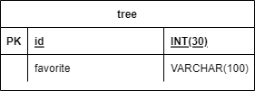
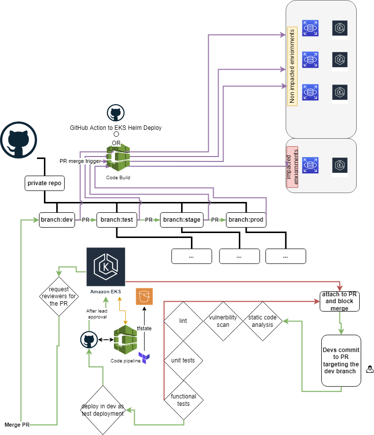
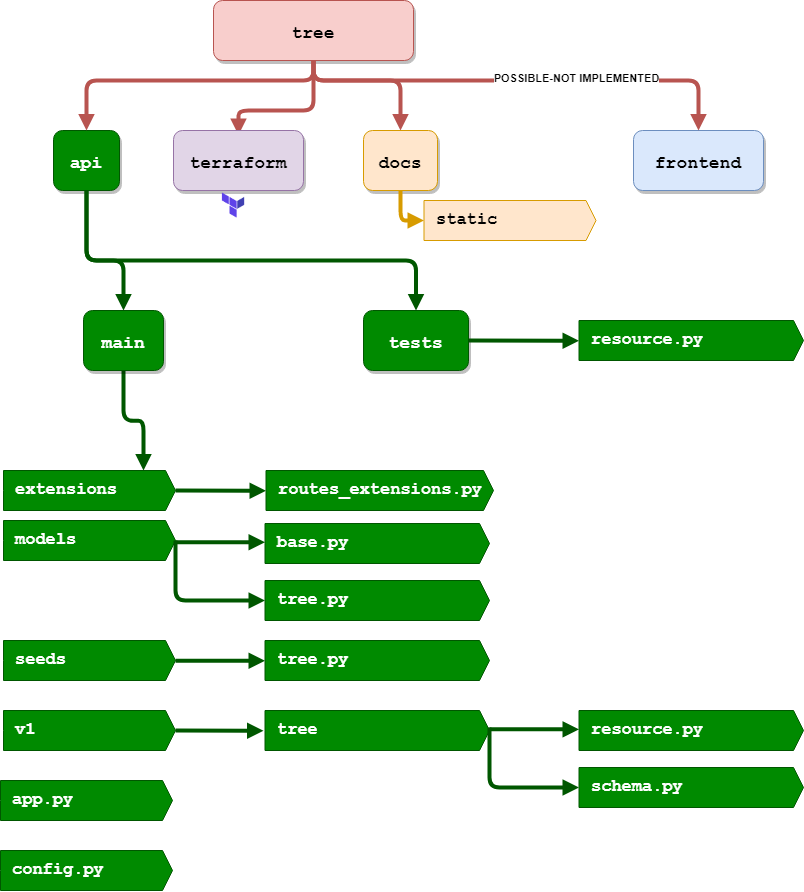

Appropriate badges such as security rating, code coverage, unit checks...etc should go here

# My Favorite Tree

This project aims to serve a simple API using Flask that fetches the favorite tree of the user. This can further expand into more operations such as patching and deleting a favorite tree.
The provided helm chart is assumed to be deployed to an EKS cluster as detailed in the arch diagram below.

## Hack it(NOT TESTED):

Looking to display your  favorite tree without needing the API and webservice ?! All through manipulating the ingress.
1. open the [`values.yaml`](chart/tree/values.yaml)
2. Set `tree-api.hack.enabled` to `true`
3. Set your favorite tree in `tree-api.hack.favoriteTree`
4. Install 
    ```
    helm install -n tree-api tree-api ./charts/tree ./charts/tree/values.yaml --create-namespace
    ```
## Quick deploy
On a fresh ubuntu 20.04 or higher run the following command that will install `microk8s`, `docker` and `mysql` along with the favorite tree API:

```bash
sudu su -
TREE_DOMAIN="my.ecosia.org"
wget https://raw.githubusercontent.com/moabu/favorite-tree/main/automation/install_demo_tree_api.sh && chmod u+x install_demo_tree_api.sh && ./install_demo_tree_api.sh $TREE_DOMAIN
```
More details on the API setup can be found in the favorite api [README](api/README.md).

## Blueprints:

### ERD



### Architecture Diagram:


### Blueprint:



## Requirements
- poetry
- terraform
- docker
- nginx ingress

## Pre-requisites
1. An EKS cluster with appropriate permissions to execute and deploy helm charts
2. Access to a private image repository to publish the API image to
3. Nginx ingress controller installed on EKS


### API configuration

Default configuration is loaded from `api.main.config` module.
You may update the values of the params in the helm charts [`values.yaml`](chart/tree/values.yaml) before installing.
You will find all the [helm parameters](chart/tree/README.md) detailed in the chart folder.


## Full pipeline installation (NOT IMPLEMENTED)

   ```
   cd terraform
   terraform init
   terraform plan
   terraform apply
   ```

A versioned enabled `s3` bucket module needs to be added to terraform infrastructure code so that to terraform state is saved, published and locked when needed.

## License

Apache license
